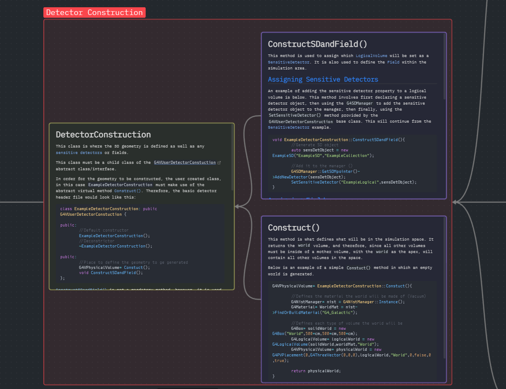
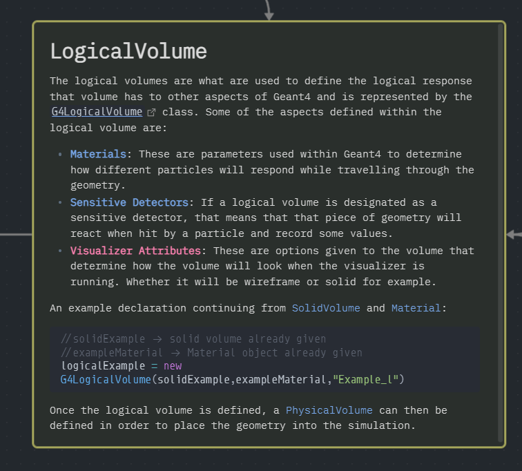
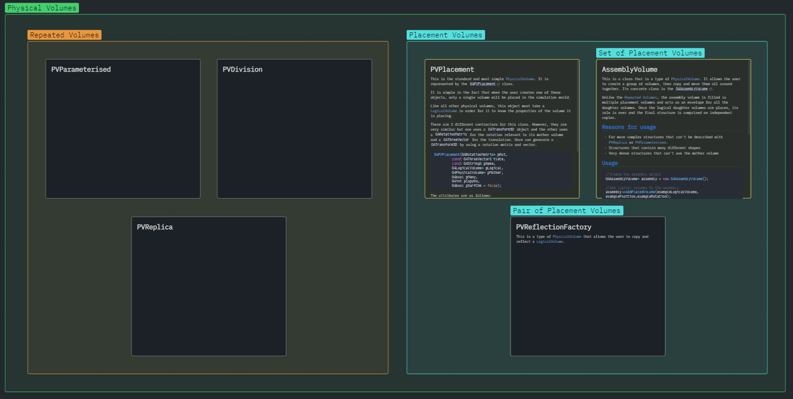

# Geant4-Obsidian-Learning-Resource

This is a collection of notes I have taken during my research into the [Geant4](https://geant4.web.cern.ch/) Simulation framework. It is still a **WIP** and it not comprehensive, However, I think it covers the absolute basics of a standard Geant4 program with some simple examples included. It is best viewed using [Obsidian](https://obsidian.md/) from the Canvas file `Geant4-Overview.canvas`.

I basic working knowledge of C++ and OOP may be needed to fully understand how to use Geant4 effectively. 

## Description
Geant4 was the focus of my BSc Physics [dissertation](https://github.com/ConnerGrice/Geant4-P2P-Investigation) as well as the focus of work I am currently doing for the University of York. I found refreshing my memory on the framework was time consuming due to all the useful information being scattered across the internet in the form of PowerPoints, forum questions, and the source code itself. This lead me to want to build a reference guide to allow me to quickly start new projects and get them running with the least amount of Google searches. It is also my first Obsidian project and I wanted to make use of the Canvas functionality to visualise how the different parts of the Geant4 framework work together.

## Overview
I have tried to cover the very basics of Geant4, from the main function, mandatory classes, and all the user action classes. The basic structure of the notes within the Canvas are as follows:

- Classes are yellow
- Virtual methods are purple
- A class and its methods are grouped in red

Throughout my research, I have also collected _most_ of the different PDFs I could find. I did not make these and I do not own them. They can be found in the `Resources` folder.

If you are reading this within Obsidian, a table of contents, linking to all the notes can be found at the bottom of this readme. Here is an overview of the whole Canvas:


Within the notes describing the class, I have included a simple example of the `.h` header file. This will include the virtual methods that must/can be implemented in the user created class. A link to the source code of the base class that the user created class will have to inherit from is also included. An example of this is in the Physics list note:


Within the method notes, I have included a simple example of how that class can be used. This is not the only way these methods can be used. I tried to pick a simple and general enough example. However, since multiple classes interact with other classes, some examples may be spread across multiple notes. It is indicated when this is the case.

Some of the time, a user created class will contain methods that must be defined. As stated above, I have tried to give examples of how to do this. When grouping classes and methods together I have used a red grouping area. This can be seen one a single block. This is shown in the image below in the case for the detector construction class:


However, some classes don't have methods associated with them. This is because these classes are used as concrete classes and are called within the user defined classes. This is shown in the case for a logical volume object:


This example also shows how other classes are connected through their example, since `solidExample` was defined in the `SolidVolume.md` note, and `exampleMaterial` was defined in the `Material.md` note.

Finally, I am including some other classes that are not necessarily attached directly to the main data flow, but can be used to help the user achieve what they want. These are separated by their own block, not connected to the rest of the diagram. This is shown in the example describing different types of physical volumes that can be used and how to use them. **NOTE: These are still a work in progress**:


Some aspects that still need to be added:

1. Touchables
2. Messengers
3. Other Physical Volume types
4. Regions
5. Macro files
6. Compiling

## Installation
The repo can be cloned using the command:
```cmd
git clone https://github.com/ConnerGrice/Geant4-Obsidian-Learning-Resource.git
```

To make use of the Canvas function and the internal links between files, Obsidian must be used. The collection of notes can still be used and read without Obsidian, but linking all the parts together may be a struggle.

I tried to minimise the number of packages used within the project but some were still used. They are included within the `.obsidian` file but they are as follows:

- [Admonition](https://github.com/valentine195/obsidian-admonition)
- [Waypoint](https://github.com/IdreesInc/Waypoint)
- [Folder Note](https://github.com/xpgo/obsidian-folder-note-plugin)

## Table of Contents
%% Begin Waypoint %%
- **[[ActionInitialization]]**
	- [[Build()]]
- **[[DetectorConstruction]]**
	- [[Construct()]]
	- [[ConstructSDandField()]]
- [[Digi]]
- **[[DigitizerModule]]**
	- [[Digitize()]]
- [[Event]]
- **[[EventAction]]**
	- [[BeginOfEventAction()]]
	- [[EndOfEventAction()]]
- **[[Field]]**
	- [[GetFieldValue()]]
- [[Hit]]
- [[LogicalVolume]]
- [[Main()]]
- [[Material]]
- [[Messengers]]
- **Physical Volumes**
	- **[[Placement Volumes]]**
	- **[[Repeated Volumes]]**
- [[PhysicalVolume]]
- **[[PhysicsList]]**
	- [[ConstructParticle()]]
	- [[ConstructProcess()]]
	- [[SetCuts()]]
- **[[PrimaryGeneratorAction]]**
	- [[GeneratePrimaries()]]
- [[RegionInformation]]
- **Resources**

- [[Run]]
- **[[RunAction]]**
	- [[BeginOfRunAction()]]
	- [[EndOfRunAction()]]
- **[[SensitiveDetector]]**
	- [[Initialize()]]
	- [[ProcessHits()]]
- [[SolidVolume]]
- [[Stack]]
- **[[StackingAction]]**
	- [[ClassifyNewTrack()]]
	- [[NewStage()]]
	- [[PrepareNewEvent()]]
- [[Step]]
- **[[SteppingAction]]**
	- [[UserSteppingAction()]]
- [[Touchable]]
- [[Track]]
- **[[TrackingAction]]**
	- [[PostUserTrackingAction()]]
	- [[PreUserTrackingAction()]]
- [[Trajectory]]

%% End Waypoint %%
